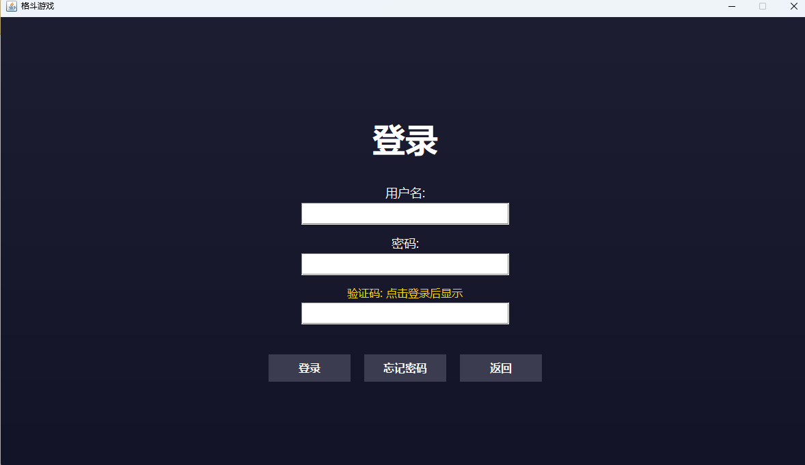
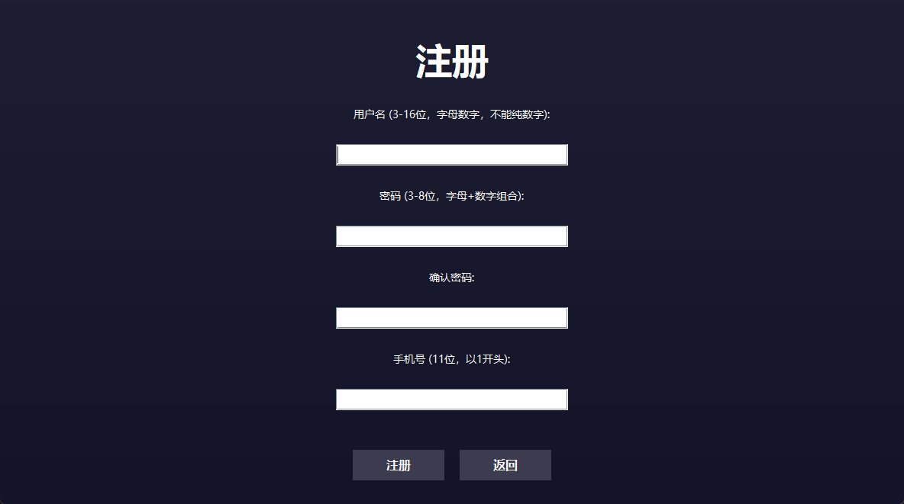
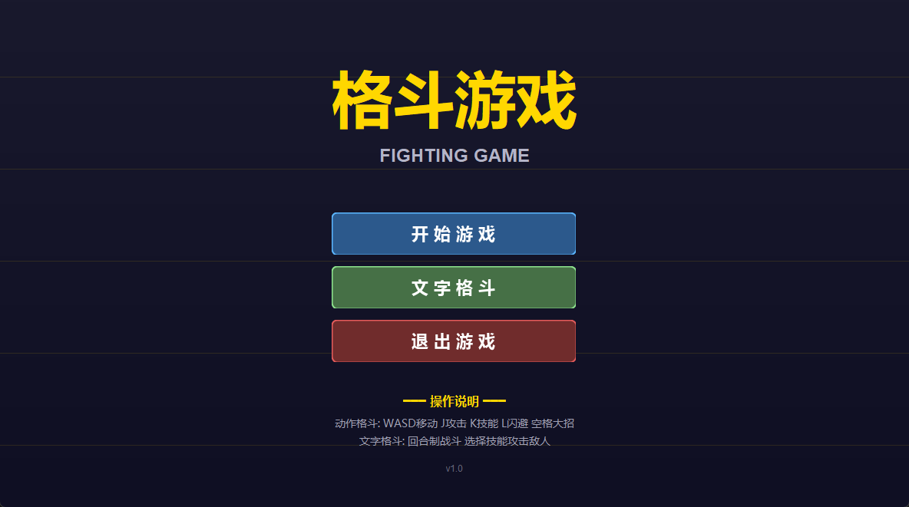
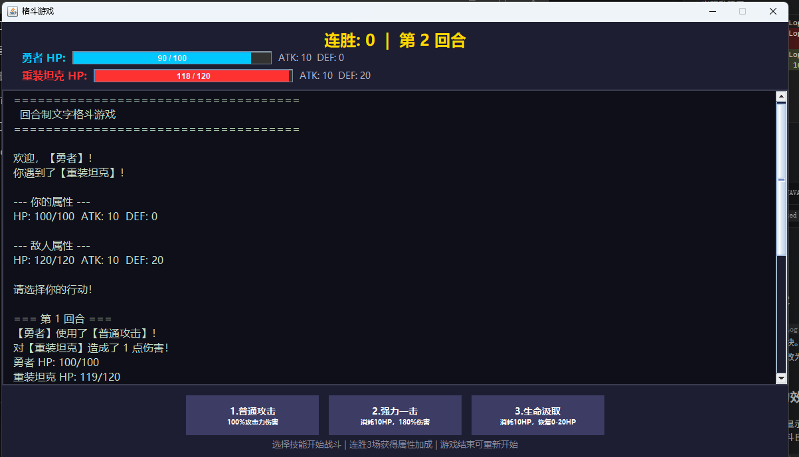

# 🎮 JavaFighter | 格斗游戏

一个基于 Java Swing 开发的1v1格斗游戏，包含**动作格斗**和**文字格斗**两种模式。


---

## 📸 游戏截图

### 登录界面


### 注册界面


### 主菜单


### 文字格斗


---

## 📖 About

**JavaFighter** 是一款使用纯 Java 开发的经典格斗游戏，致敬童年街机游戏回忆。

🎮 **双模式体验**
- **动作格斗**：实时操控角色，释放华丽技能，体验格斗游戏的快感
- **文字格斗**：策略回合制，分配属性点，挑战不同敌人

⚔️ **丰富的游戏内容**
- 4个风格迥异的可操作角色（含隐藏角色武圣）
- 完整的登录注册系统
- 道具系统 + 蓝条系统 + 成长系统
- 搞笑的嘲讽话术

🎯 **技术亮点**
- 纯 Java Swing 实现，无第三方依赖
- MVC 架构设计，代码结构清晰
- 状态机管理模式切换
- 文件序列化存储用户数据

> 🕹️ **开发者说**：这不仅是一个游戏项目，更是对 Java 图形编程和游戏开发的学习与实践。希望这个项目能帮助更多人了解游戏开发的魅力！

---

## ✨ 功能特性

### 🎯 双模式游戏

| 模式 | 描述 | 特点 |
|------|------|------|
| **动作格斗** | 1v1实时对战 | 4个角色、4个技能、3局2胜 |
| **文字格斗** | 回合制战斗 | 20点属性分配、4种敌人、道具系统 |

### 👥 角色系统

#### 动作格斗角色
| 角色 | 类型 | 技能1 | 技能2 | 技能3 | 大招 |
|------|------|-------|-------|-------|------|
| 🗡️ 剑豪 | 均衡型 | 刺(30伤害) | 劈(40伤害) | 闪 | 剑气纵横(150-300) |
| 👊 拳师 | 爆发型 | 刺拳(30伤害) | 重拳(50伤害) | 格挡 | 暴风连拳(180+回血60) |
| 🗡️ 刺客 | 敏捷型 | 劈(40伤害) | 跳劈(50伤害) | 影袭 | 背刺(闪现+100) |
| ⭐ 武圣 | 隐藏角色 | 刺(30伤害) | 劈(40伤害) | 格挡 | 武圣降临(真伤1000) |

**武圣解锁条件**：玩家累计战败3次

#### 文字格斗敌人
| 敌人 | HP | ATK | DEF | 技能 |
|------|-----|-----|-----|------|
| 初级战士 | 80 | 15 | 10 | 猛击(150%) |
| 敏捷刺客 | 60 | 20 | 5 | 快速攻击(2次50%) |
| 重装坦克 | 120 | 10 | 20 | 防御姿态(伤害减半) |
| 神秘法师 | 70 | 25 | 8 | 火球术(180%) |

### 🔐 登录注册系统

- ✅ 用户名/密码验证
- ✅ 验证码防机器人
- ✅ 账号锁定机制（3次错误）
- ✅ 手机号绑定
- ✅ 忘记密码找回

### 🎒 道具系统

| 道具 | 效果 | 获取方式 |
|------|------|----------|
| 🍑 桃子 | 生命+10 | |
| 🥚 煎蛋 | 生命+20 | 战斗结束 |
| 🍗 花酿鸡 | 生命+30 | 30%几率 |
| 🐟 黑背鲈鱼 | 生命+40 | 随机获取 |
| 🍲 白玉汤 | 生命+50 | |

### 💬 嘲讽系统

战斗失败时，敌人会随机说出嘲讽话语：

> "就这？我还以为多厉害呢！"
> "回去再练练吧，菜鸟！"
> "你的操作让我想起了我的奶奶..."
> "这就是你的全部实力吗？太让我失望了！"

---

## 🎮 游戏流程

```
启动游戏
    ↓
┌─────────────┐
│   登录界面   │ ←── 验证码显示
└─────────────┘
    ↓
┌─────────────┐
│   主菜单    │
└─────────────┘
    ↓
┌───────┴───────┐
↓               ↓
动作格斗      文字格斗
   ↓            ↓
角色选择     属性分配(20点)
   ↓            ↓
1v1对战      回合制战斗
   ↓            ↓
3局2胜       连胜奖励
   ↓            ↓
胜负结算     道具获取
```

---

## 🎹 操作说明

### 动作格斗模式

#### Player 1
| 按键 | 功能 |
|------|------|
| `A` `D` | 左右移动 |
| `W` | 跳跃 |
| `J` | 普通攻击 |
| `K` | 技能攻击 |
| `L` | 闪避 |
| `空格` | 大招 |

#### Player 2
| 按键 | 功能 |
|------|------|
| `←` `→` | 左右移动 |
| `↑` | 跳跃 |
| `小键盘1` | 普通攻击 |
| `小键盘2` | 技能攻击 |
| `小键盘3` | 闪避 |
| `小键盘0` | 大招 |

### 文字格斗模式

点击按钮选择技能：

1. **普通攻击** - 100%攻击力伤害
2. **强力一击** - 消耗10HP，180%伤害
3. **生命汲取** - 消耗10HP，恢复0-20HP
4. **使用道具** - 从背包选择道具回血

---

## 📊 属性系统

### 角色属性计算

```
生命值(HP) = 100 + 分配点数 × 10
攻击力(ATK) = 10 + 分配点数 × 2
防御力(DEF) = 0 + 分配点数 × 1
```

### 成长系统

| 成长类型 | 条件 | 效果 |
|----------|------|------|
| 玩家成长 | 每3胜 | HP+30, ATK+5, DEF+3 |
| 怪物成长 | 每连胜 | HP+10, ATK+3, DEF+2 |

### 伤害计算

```
基础伤害 = ATK × 技能倍率% - DEF
最小伤害 = 1
防御减免 = 20%（动作格斗）
```

---

## 🚀 快速开始

### 环境要求

- **JDK 8** 或更高版本
- Windows / macOS / Linux

### 编译运行

#### 方法1：使用脚本（Windows）

```bash
# 编译
compile.bat

# 运行
run.bat
```

#### 方法2：手动编译

```bash
# 编译
javac -d bin -sourcepath src/main/java src/main/java/com/fighting/GameApp.java

# 运行
java -cp bin com.fighting.GameApp
```

---

## 📁 项目结构

```
格斗游戏/
├── src/main/java/com/fighting/
│   ├── GameApp.java                 # 主入口
│   ├── core/
│   │   ├── GameEngine.java          # 游戏主循环
│   │   ├── GameState.java           # 游戏状态
│   │   └── InputHandler.java        # 输入处理
│   ├── model/
│   │   ├── Character.java           # 动作角色
│   │   ├── GameCharacter.java       # 文字角色
│   │   ├── Enemy.java               # 敌人类
│   │   ├── Skill.java               # 技能类
│   │   ├── Player.java              # 玩家类
│   │   ├── User.java                # 用户类
│   │   └── Consumable.java          # 道具类
│   ├── characters/
│   │   ├── Swordsman.java           # 剑豪
│   │   ├── Boxer.java               # 拳师
│   │   ├── Assassin.java            # 刺客
│   │   └── Wusheng.java             # 武圣
│   ├── system/
│   │   ├── BattleSystem.java        # 动作战斗
│   │   ├── TextBattleSystem.java    # 文字战斗
│   │   ├── CollisionDetector.java   # 碰撞检测
│   │   ├── CharacterFactory.java    # 角色工厂
│   │   ├── UserManager.java         # 用户管理
│   │   └── TauntSystem.java         # 嘲讽系统
│   ├── ui/
│   │   ├── MainFrame.java           # 主窗口
│   │   ├── MenuPanel.java           # 主菜单
│   │   ├── LoginPanel.java          # 登录面板
│   │   ├── RegisterPanel.java       # 注册面板
│   │   ├── CharacterSelectPanel.java# 角色选择
│   │   ├── BattlePanel.java         # 动作战斗
│   │   ├── CreateCharacterPanel.java# 创建角色
│   │   └── TextBattlePanel.java     # 文字战斗
│   └── util/
│       └── Constants.java           # 常量定义
├── data/
│   └── users.dat                    # 用户数据
├── bin/                             # 编译输出
├── compile.bat                      # 编译脚本
└── run.bat                          # 运行脚本
```

---

## 🛠️ 技术栈

- **语言**: Java 8+
- **GUI**: Java Swing
- **架构**: MVC + 状态机模式
- **存储**: 文件序列化 (ObjectOutputStream)
- **设计模式**: 工厂模式、单例模式

---

## 📝 更新日志

### v1.0 (2024-09-10)

#### 新增功能
- ✅ 登录注册系统（验证码、账号锁定）
- ✅ 忘记密码功能
- ✅ 动作格斗模式（1v1实时对战）
- ✅ 文字格斗模式（回合制战斗）
- ✅ 4个角色（剑豪、拳师、刺客、武圣）
- ✅ 20点属性分配系统
- ✅ 4种敌人类型
- ✅ 道具系统（5种道具）
- ✅ 蓝条系统（MP）
- ✅ 嘲讽系统
- ✅ 成长系统（玩家+怪物）
- ✅ 屏幕震动效果

---

## 🎯 后续计划

- [ ] 添加音效系统
- [ ] 添加精灵动画
- [ ] 添加AI对手
- [ ] 添加排行榜
- [ ] 网络联机对战
- [ ] 使用LibGDX重写

---

## 📄 许可证

本项目仅供学习使用。

---

## 👨‍💻 作者

GitHub: [Y7NINE](https://github.com/Y7NINE)

---

## ⭐ 如果觉得有用，请给个Star！
